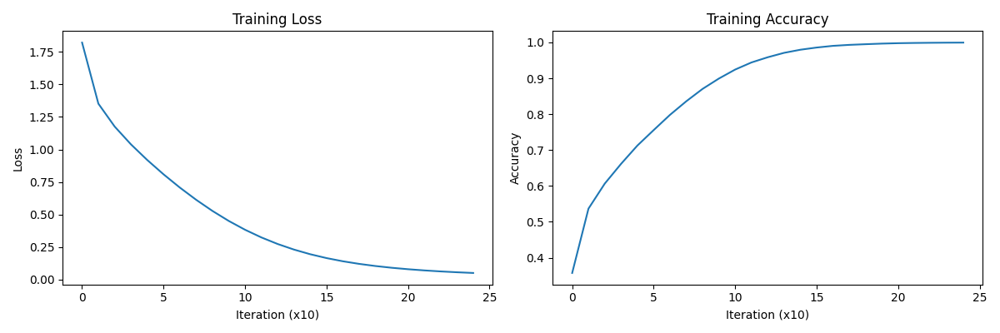

# CIFAR-10 Neural Network Classifier

A basic neural network implementation for classifying CIFAR-10 images.

## Performance

- Training accuracy: 99.9% (overfitted)
- Test accuracy: 51.60%

## Future Improvements

The model is currently overfitting. Performance can be enhanced through:
- Data augmentation
- Regularization techniques (e.g., dropout, L2)
- Architecture modifications
- Hyperparameter tuning

## Run the main script:
   ```
   python script_name.py --mode train

   ```
OR
  ```
  python image_class.py --mode test --weights cifar10_weights.h5
  ```
# Loss and Accuracy(training) vs Iterations
  
